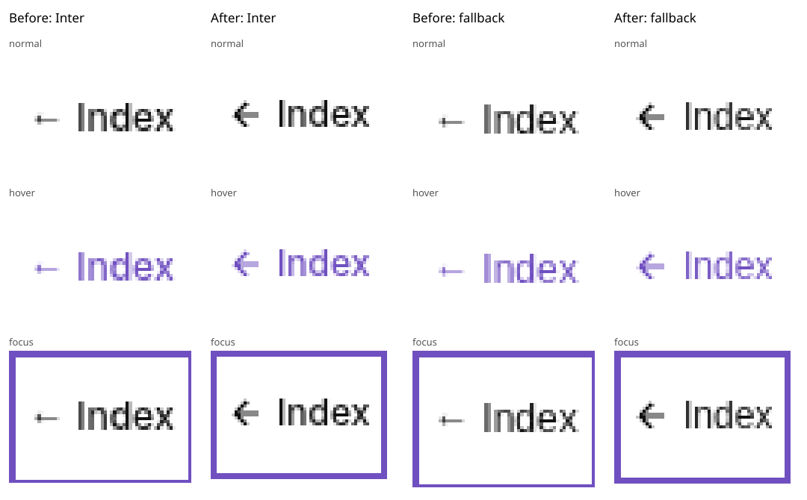

# Issue 72: Utility Index arrow

The shared Index button uses a 12px inline SVG with `currentColor`, centered
beside a label span by inline flex. This removes the Inter-specific glyph lift.
The button's native semantics, 30.8px height, existing padding, purple hover,
focus outline, and responsive 54px/46px toolbar heights are preserved.



Baseline: refreshed `origin/main` at `4cfc1c52041d929ee2b14153b28a6657b091469e`.
The original button was captured before editing at 1440 × 900, DPR 1, 100% scale,
with real Inter and deliberately blocked Google Fonts. In this Linux Chromium
rendering the old arrow was slightly low; the reporter's exact high-arrow
appearance was not reproduced. Images above are enlarged with nearest-neighbor
sampling to expose the small differences. The baseline text arrow uses the host
fallback font because this Latin Inter fixture does not include U+2190; the
Index label uses Inter in the loaded-font screenshots.

## Focused browser coverage

The compact test is part of `npm run utilities:browser-check`. The packaged
utilities release group runs the full matrix separately on Chromium, Firefox,
and WebKit so it has its own time budget. It can also be run directly:

```sh
UTILITIES_BROWSER=chromium node scripts/index-arrow-check.js
# Optional installed browser path, useful when pinned Playwright downloads are unavailable:
INDEX_ARROW_BROWSER_EXECUTABLE=/usr/bin/chromium node scripts/index-arrow-check.js
```

The test measures visible ink bounds separately for the arrow and text, with a
maximum one-CSS-pixel center difference to allow rasterization rounding. It also
checks layout centers, target/toolbar heights, accessible name, SVG decoration,
hover color, keyboard focus, click/Enter/Space, the switcher, history Back/Forward,
and footer visibility. Screenshots, 8× details at normal scale, and measured
geometry are written to `output/playwright/index-arrow/<browser>/`; the compact
check writes to its `compact/` subdirectory.

Local run on October 4, 2026: system Chromium 151.0.7922.173 on Linux, 192 rendered
samples, all passing. Loaded Inter samples differed by at most 0.5 CSS px; blocked
and delayed fallback samples by at most 1 CSS px.

| Dimension | Coverage |
| --- | --- |
| Utility | Image Transform, Fourier Reconstruction, Stress Test |
| Font | Blocked Google Fonts, delayed Inter, actual Inter swap after first paint |
| Viewport | 1440 × 900 and 800 × 520, with `?full=1` |
| Scale | CSS zoom 100%, 125%, 150%, 200% |
| DPR | 1 and 2 |
| Interaction appearance | Normal throughout; hover/focus at 100% for both viewports and DPRs |

Inter is an unmodified, licensed `@fontsource/inter@5.2.8` test fixture served via
intercepted Google Fonts routes. No external request is needed for these checks.
The fixture is excluded from deployment because it lives under `scripts/`.

## Validation and limits

Source quality, utility typecheck, 505 unit/integration tests, utilities build,
deployment build, deployment smoke, and deployment local links passed. Five
existing tests are skipped. The packaged PR smoke passed using the local Inter
fixture and system Chromium selected by an untracked Node preload. The full
source utilities browser check passed. Packaged Chromium release checks also
passed: full alignment matrix (26.2s), main utility check (236.0s), image
preparation (58.6s), and stress (48.1s). The first packaged utility run reached
the 300s limit with the full matrix embedded in it. The matrix now has its own
release check; the main suite keeps a 27-sample compact regression. Both changed
checks were rerun successfully; already-passing preparation/stress checks were
retained. Other release groups were outside this change’s local verification.

Pinned Playwright browser downloads were blocked with HTTP 403 “Domain
forbidden” at `cdn.playwright.dev`. Firefox and WebKit could not be run locally.
Native browser zoom and Windows/macOS system fonts are unverified. The CSS zoom
matrix is a layout/rasterization approximation, not native browser zoom coverage.
The live Google Fonts endpoint is also unverified: packaged PR smoke initially
failed on `net::ERR_TUNNEL_CONNECTION_FAILED`, then passed with test-only local
font responses. No production font loading or network configuration changed.
